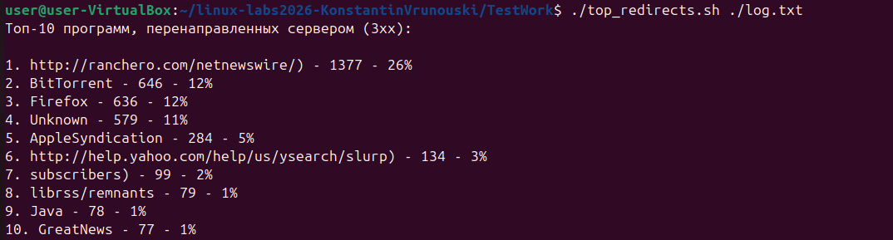

# Apache Log Analyzer – Топ перенаправленных программ

## 📋 Описание

Скрипт `top_redirects.sh` анализирует **Access Log** веб-сервера Apache в стандартном формате (`combined`) и выводит в стандартный вывод **топ-10 программ** (User-Agent), которые были **перенаправлены сервером** (HTTP-коды ответа, начинающиеся с `3`).

Для каждой программы в топе выводится:
- порядковый номер
- название программы (без версии)
- количество перенаправлений (абсолютное)
- процент от общего числа перенаправлений для всех программ в выборке

Screenshot:

