# Отчёт по лабораторной работе №7

## Bash-скриптинг

**Вариант №1**

**Выполнил:** Студент группы 7121
**ФИО:** Вруновский Константин Андреевич

---

## Оглавление

1. [Цель работы](#цель-работы)
2. [Задание 7.2.1 – Бесконечный процесс с сбросом счётчика](#задание-721--бесконечный-процесс-с-сбросом-счётчика)
3. [Задание 7.2.2 – Программирование Bash](#задание-722--программирование-bash)
4. [Индивидуальное задание – Вариант 1](#индивидуальное-задание--вариант-1)

---

## Цель работы

Изучение основ написания сценариев Bash: работа с переменными, условными операторами, циклами, функциями, обработкой сигналов, аргументами командной строки, а также выполнение индивидуального задания по автоматизации задач администрирования.

---

## Задание 7.2.1 – Бесконечный процесс с сбросом счётчика

### Описание

Разработан сценарий, который реализует бесконечный цикл с выводом значения счётчика каждые 2 секунды. Каждые 10 секунд счётчик автоматически сбрасывается в ноль. Предусмотрено корректное завершение работы сценария при нажатии комбинации клавиш `Ctrl+Z`.

### Выполненные действия

- Создан исполняемый файл сценария
- Реализован бесконечный цикл с задержкой 2 секунды
- Добавлен механизм отслеживания времени для сброса счётчика
- Обеспечена обработка сигнала `SIGTSTP` (Ctrl+Z) для корректного завершения
- Протестирована работа сценария в терминале

---

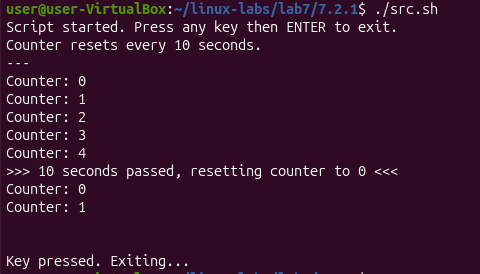

## Задание 7.2.2 – Программирование Bash

В рамках данного задания разработаны следующие сценарии:

### Упражнение 1 – Определение знака числа
Сценарий запрашивает у пользователя целое число и определяет, является ли оно положительным, отрицательным или нулём.

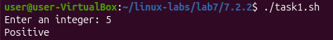

### Упражнение 2 – Вычисление факториала
Сценарий запрашивает целое число и вычисляет его факториал с использованием цикла.

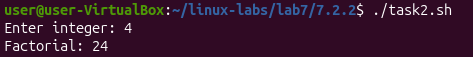

### Упражнение 3 – Список сетевых интерфейсов
Сценарий выводит список всех сетевых интерфейсов, подключённых к системе, с использованием цикла и команды `ls`.

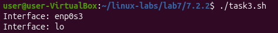

### Упражнение 4 – Статус сетевых интерфейсов
Сценарий для каждого зарегистрированного в системе сетевого интерфейса выводит его статус (up/down).

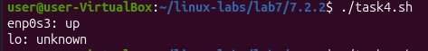

### Упражнение 5 – Имя и расширение файла
Сценарий запрашивает имя файла, разделяет его на имя и расширение, выводит их отдельно.

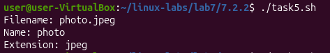

### Упражнение 6 – Переименование .jpeg файлов
Сценарий находит в текущем каталоге все файлы с расширением `.jpeg` и добавляет к их именам префикс `new_`.

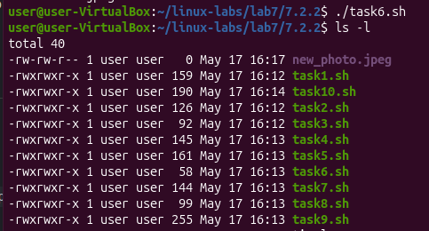

### Упражнение 7 – Файлы с правами 755
Сценарий выводит все файлы из указанной директории (включая подкаталоги), которые имеют права доступа 755. Для хранения списка файлов используется массив.

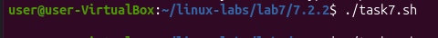

### Упражнение 8 – Генерация случайных имён файлов
Сценарий генерирует 10 уникальных имён файлов с префиксом `fileN` и случайным суффиксом. Для генерации случайных символов используются утилиты `mcookie` и другие.

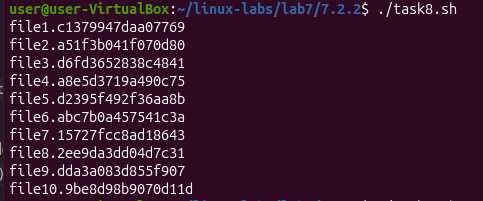

### Упражнение 9 – Фото с веб-камеры
Сценарий делает снимок с веб-камеры с помощью утилиты `fswebcam` и сохраняет его в заданную папку. При отсутствии утилиты предусмотрена её автоматическая установка.

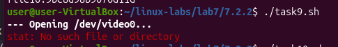

### Упражнение 10 – Уведомления об аутентификации
Сценарий отслеживает события аутентификации в графическом интерфейсе и отправляет уведомление пользователю с помощью `notify-send` при каждом успешном входе.

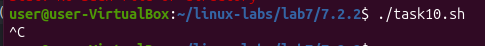

---

## Индивидуальное задание – Вариант 1

### Задача 1 – Информация о пользователе

**Описание:** Разработан сценарий, который запрашивает имя пользователя. Если пользователь не зарегистрирован в системе, выводится сообщение об ошибке и запрос повторяется. Для зарегистрированного пользователя выводятся: уникальный идентификатор (UID), основная (первичная) группа и список всех групп (через пробел).

**Реализовано:**
- Циклический запрос имени до получения корректного ввода
- Проверка существования пользователя командой `id`
- Вывод UID, первичной и дополнительных групп
- Вывод сообщений об ошибках в `stderr`

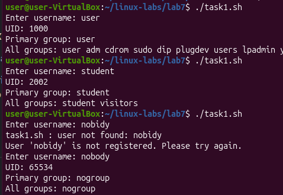

### Задача 2 – Установка маски прав (umask)

**Описание:** Сценарий создаёт файл с заданным пользователем именем и устанавливает для него заданную маску разрешений на доступ. После завершения работы сценария маска прав восстанавливается до значения, используемого по умолчанию.

**Реализовано:**
- Запрос имени файла и значения umask
- Проверка корректности введённой маски
- Временная смена umask, создание файла
- Восстановление исходной маски

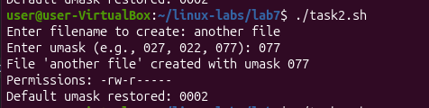

### Задача 3 – Поиск файлов по размеру

**Описание:** Разработан сценарий для поиска файлов заданного размера в указанном каталоге и всех его подкаталогах. Диапазон размеров (минимум – максимум) задаётся первыми двумя аргументами командной строки, имя каталога – третьим аргументом. Проведена проверка работы для каталога `/usr` с диапазоном 1000–1510 байт.

**Реализовано:**
- Проверка корректности входных аргументов
- Рекурсивный обход каталога
- Сравнение размера каждого файла с заданным диапазоном
- Вывод списка найденных файлов с указанием размера

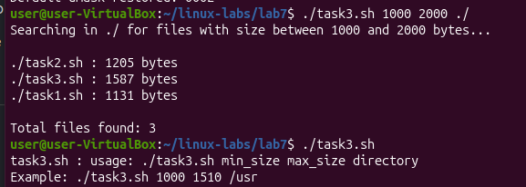

### Задача 4 – Анализ лог-файла

**Описание:** Сценарий анализирует системный лог-файл (`/var/log/syslog`), выделяет строки, содержащие слово "error", подсчитывает количество повторений каждого уникального сообщения об ошибке, выводит топ-5 самых частых ошибок и сохраняет отчёт в отдельный файл с датой в имени.

**Реализовано:**
- Чтение и фильтрация лог-файла
- Подсчёт частоты уникальных сообщений
- Сортировка по убыванию частоты
- Вывод топ-5 ошибок на экран
- Сохранение полного отчёта в файл с временной меткой

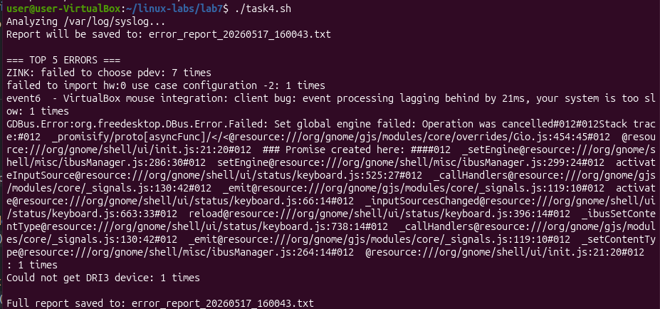

---
