# Отчёт по лабораторной работе №8

## Инструментальные средства обработки текстовых данных (awk, sed, grep, find, tr, wc)

**Вариант:** №1

**Выполнил:** Вруновский Константин Андреевич

**Каталог работы:** `linux-labs2026-KonstantinVrunouski/lab8/`

---

## Оглавление

1. [Цель работы](#цель-работы)
2. [Протоколирование](#протоколирование)
3. [Задание 2.1 — примеры awk](#задание-21--примеры-awk)
4. [Задание 2.2 — примеры sed](#задание-22--примеры-sed)
5. [Задание 2.3 — вариант 1](#задание-23--вариант-1)
6. [Задание 2.4 — grep, find, tr, wc](#задание-24--grep-find-tr-wc)

---

## Цель работы

Изучить утилиты обработки текстовых данных **awk** и **sed**, а также применить **grep**, **find**, **tr** и **wc** для фильтрации, поиска и преобразования файлов в ОС Linux.

---

## Протоколирование

Перед выполнением заданий включена запись протокола командой `script` с журналом меток времени:

- `tasklog1Vrunouski` — протокол команд;
- `timelog1Vrunouski` — журнал меток времени.

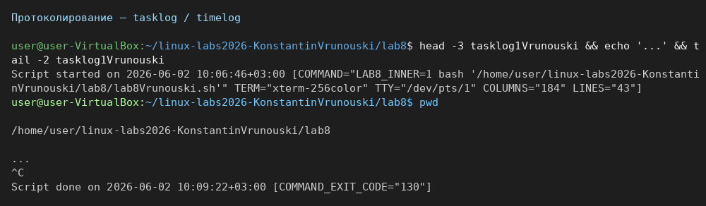

---

## Задание 2.1 — примеры awk

Подготовлен каталог `2.1/examples/` с файлами `log.txt`, `myfile`, `list_students`, `colours.csv`.

### Пример 1 — поиск bash в log.txt

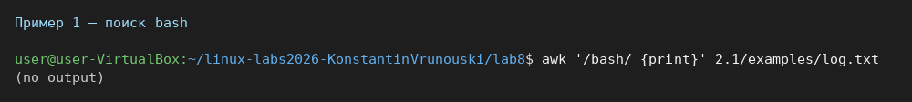

### Пример 3 — вывод первого поля

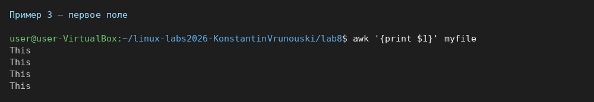

### Пример 5 — фамилия, имя, оценка

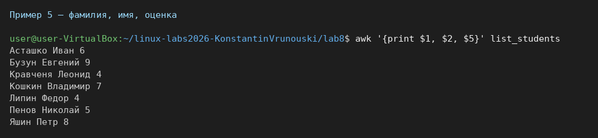

### Пример 7 — студенты с оценкой 4

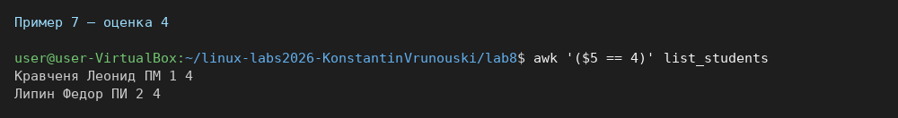

### Пример 10 — нумерация строк

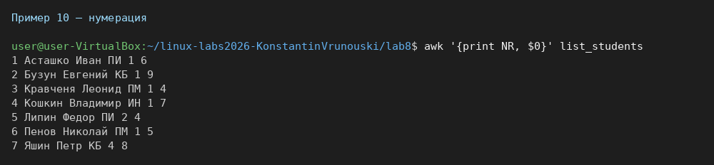

### Пример 12 — сумма оценок

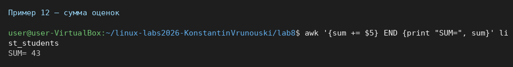

### Пример 15 — colours.csv, amount > 6

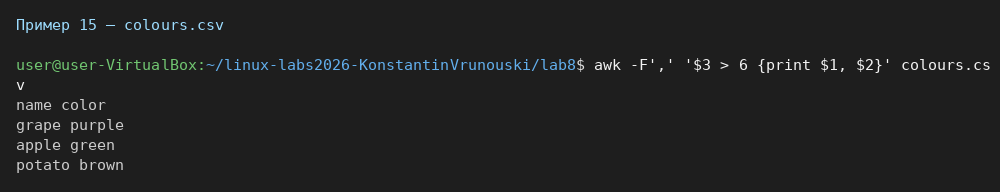

---

## Задание 2.2 — примеры sed

Создан файл `2.2/books`, файлы `records`, `appends`, `insert`.

### Пример 2 — дублирование строк с book

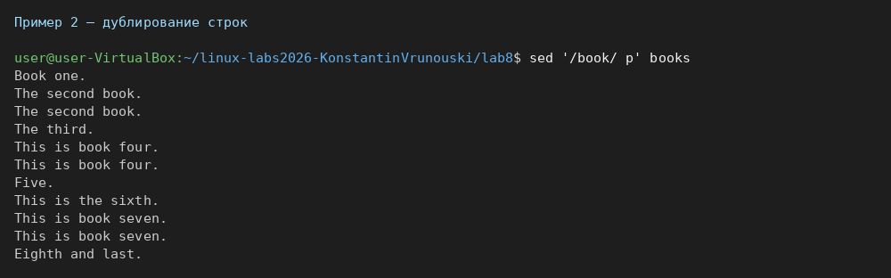

### Пример 3 — только строки с book

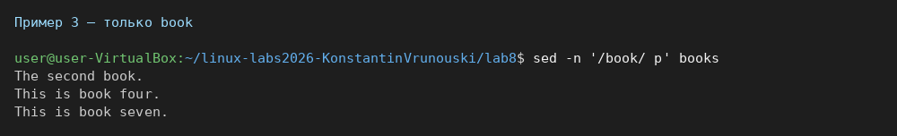

### Пример 4 — строки 2–5

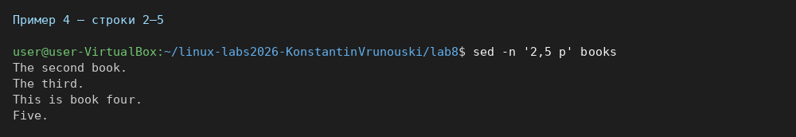

### Пример 5 — команды из файла records

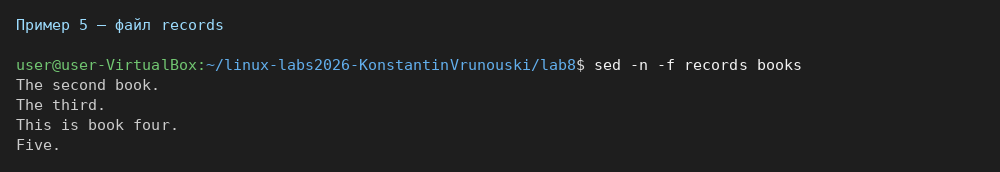

### Пример 6 — добавление строки после 3-й

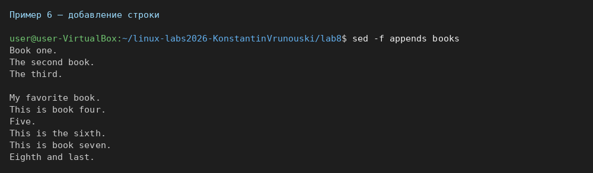

### Пример 7 — вставка SKARBONKA

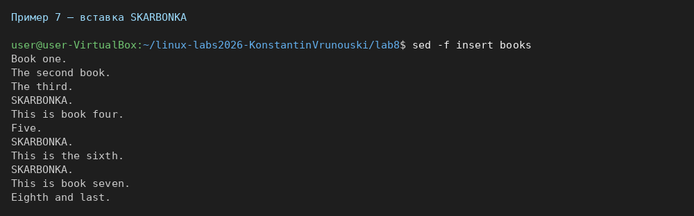

### Пример 8 — замена book на novel

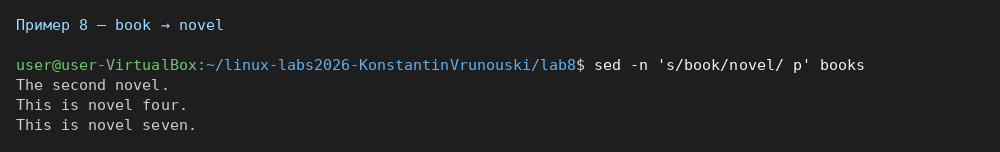

---

## Задание 2.3 — вариант 1

### Общее задание — сетевые интерфейсы

Скрипт `2.3/network_interfaces.sh` использует `ip`, **awk** и каталог `/sys/class/net/`, исключает `lo`, нумерует вывод.

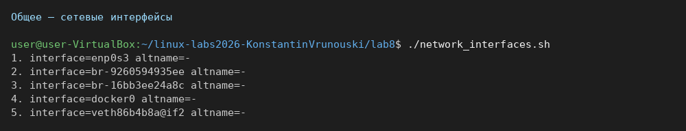

### Задание 1 — чётные строки cars.txt

Файл `cars.txt` в каталоге `lab8/`. AWK-программа `task1_cars_even.awk` выводит чётные строки; производитель — в верхнем регистре.

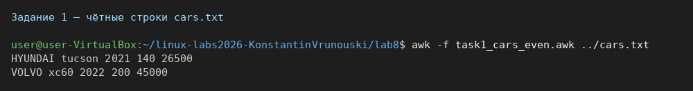

### Задание 2 — площадь и периметр прямоугольника

`rectangle.awk` — функции `area()`, `perimeter()`, вызов из `main()`.

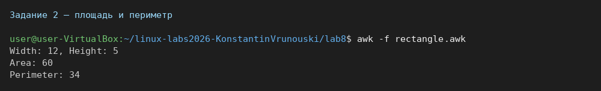

### Задание 3 — замена второй запятой на |

Файл `comma_data.txt`, команда **sed** с группами `\([^,]*\)`.

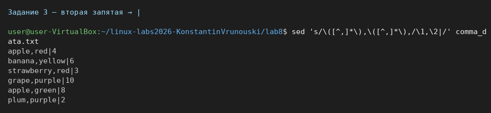

---

## Задание 2.4 — grep, find, tr, wc

### grep

#### Задание 1 — файл dirlist.txt

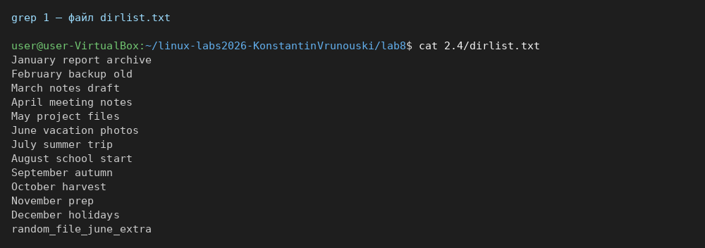

#### Задание 2 — строки с месяцем June

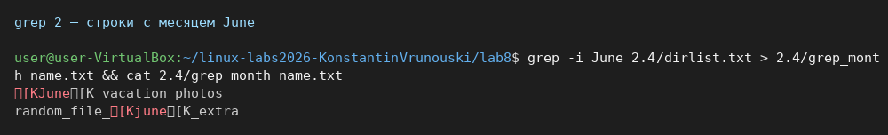

#### Задание 3 — строки без June

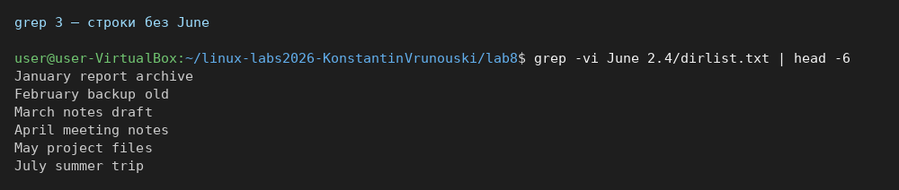

#### Задание 4 — каталог grep/

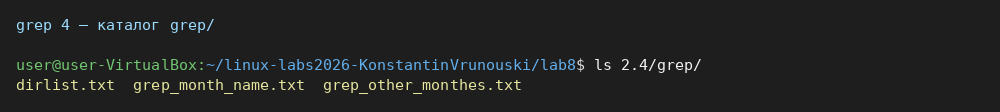

#### Задание 5 — поиск root в mac_os_lab

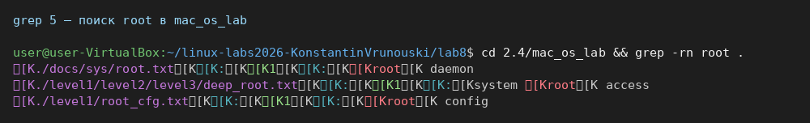

#### Задание 6 — слова из строчных букв

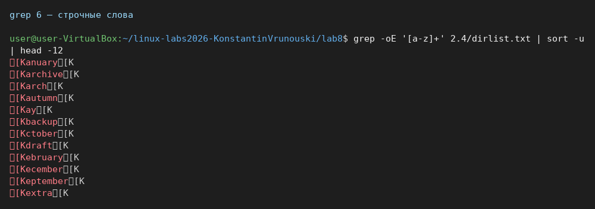

#### Задание 7 — config в /etc

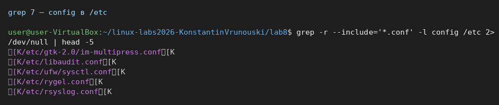

#### Задание 8 — warning в /var/log

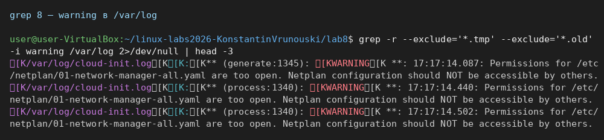

#### Задание 9 — Kernel с номерами строк

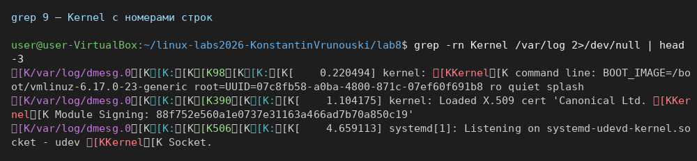

#### Задание 10 — подсчёт pattern

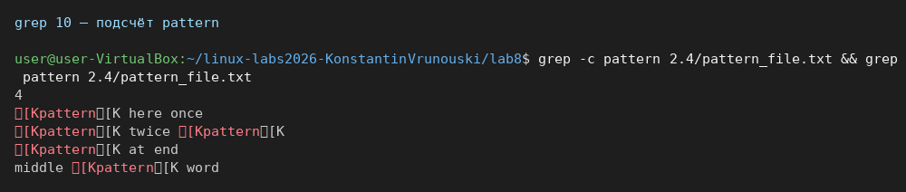

### find

#### Задание 11 — файлы *bash*

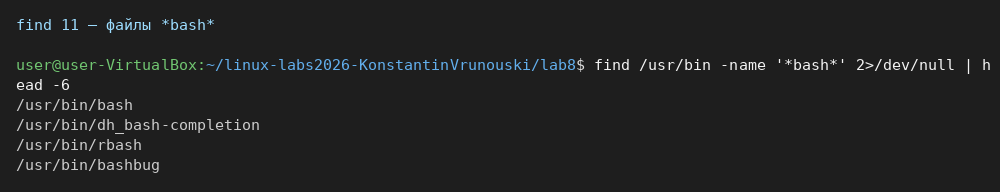

#### Задание 12 — .txt в lab8

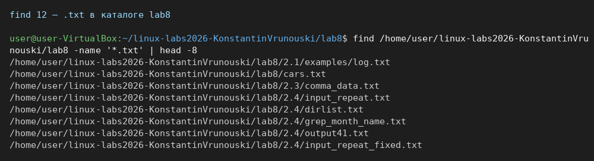

#### Задание 13 — символические ссылки в /

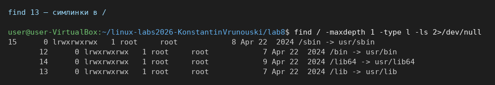

#### Задание 14 — /var/log за 7 дней

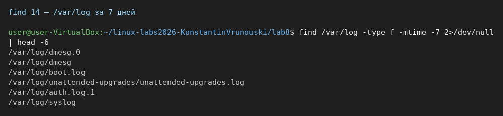

#### Задание 15 — удаление старых файлов (tmp_demo)

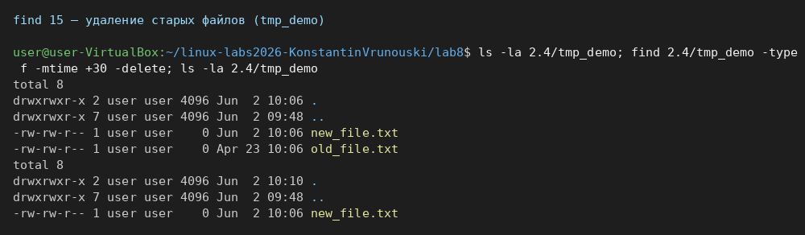

#### Задание 16 — права 777 в /home

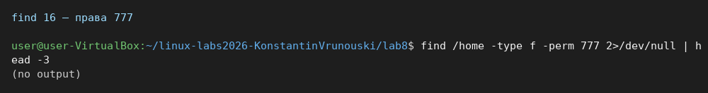

#### Задание 17 — файлы пользователя student

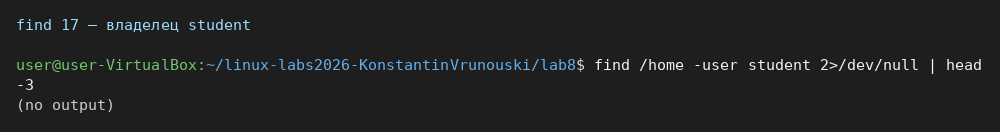

#### Задание 18 — файлы >100 МБ в /var

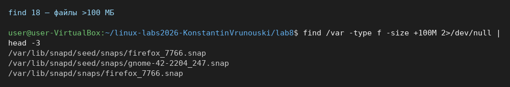

#### Задание 19 — error в .log

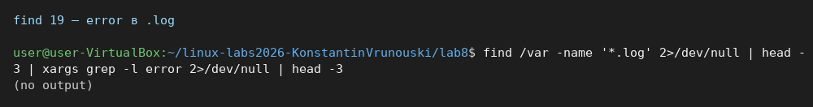

#### Задания 20–21 — поиск «Текст» в кодировках

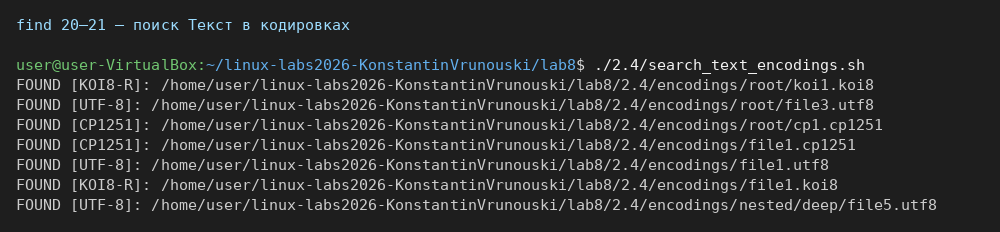

### tr

#### Задание 22 — cat | tr

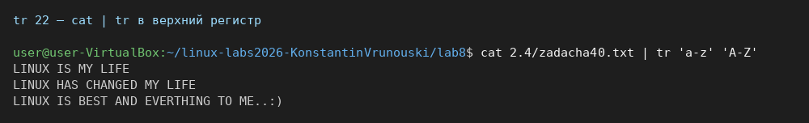

#### Задание 23 — tr с перенаправлением <

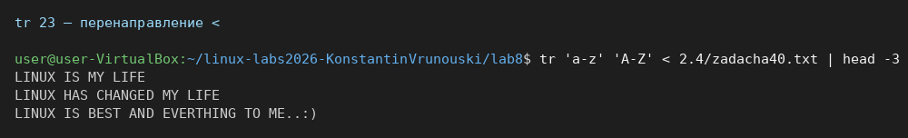

#### Задание 24 — удаление буквы t

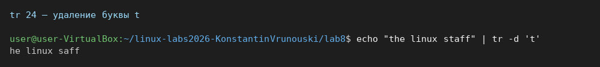

### wc

#### Задание 25 — wc для linux_os.txt

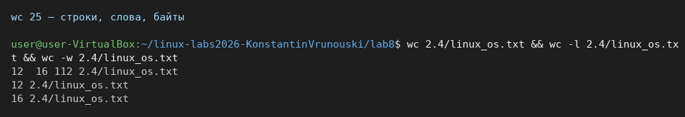

#### Задание 26 — число файлов в HOME

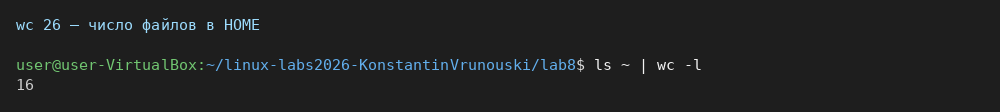

#### Задание 27 — слова после upper

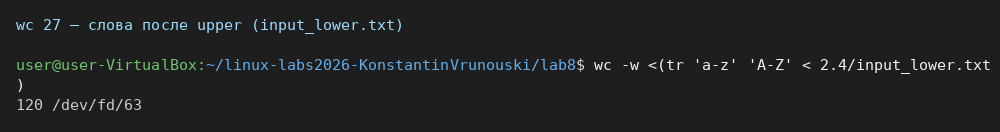

#### Задание 28 — строки после сжатия пробелов

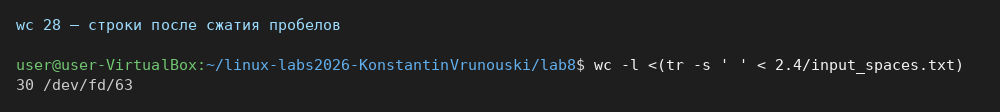

#### Задание 29 — байты после замены :

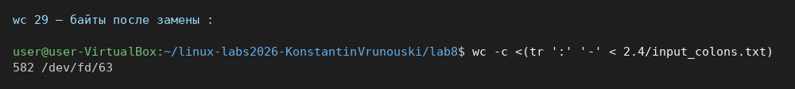

#### Задание 30 — слова без цифр

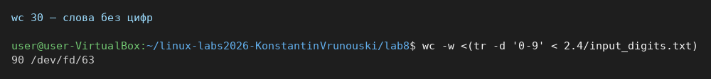

#### Задание 31 — уникальные строки

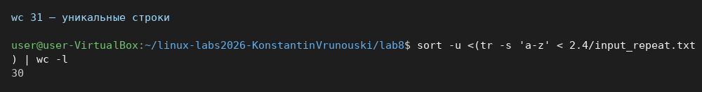

---
